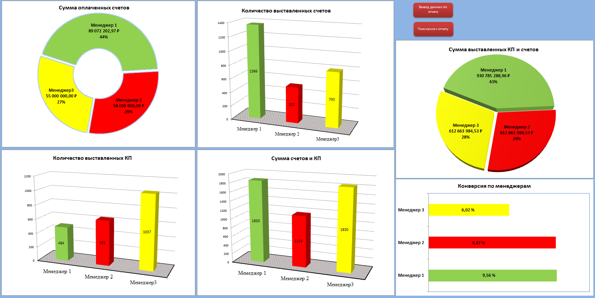
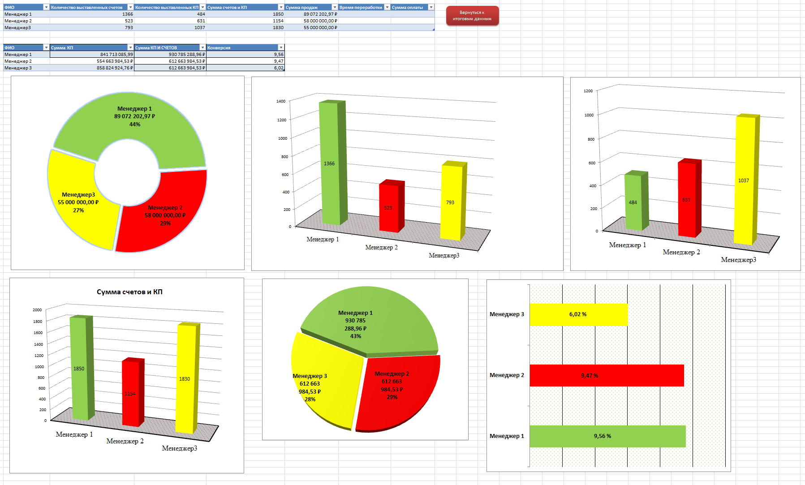

# Sales analysis (Excel + Word)

## Описание проекта
Аналитический проект по оценке экономической эффективности и загруженности сотрудников на основе данных продаж и активности.

## Инструменты
- Excel: расчёты, сводные таблицы, анализ показателей
- Word: итоговый аналитический отчёт

## Структура проекта
- `Report/` — аналитический отчёт
- `Data/` — исходные данные и расчёты
- `Materials/` — вспомогательные материалы

## Ключевые моменты анализа
- сравнение показателей по сотрудникам
- анализ динамики и загрузки
- выявление ограничений данных и зон роста

## Ограничения данных
Отсутствуют полные данные по воронке (КП → счёт → оплата), поэтому выводы сделаны на основе доступных метрик.

## Результат
Сформулированы выводы и практические рекомендации для руководства.

## Быстрый обзор проекта
Краткое резюме проекта (1 страница, PDF):
- [Summary_Sales_Analysis_Excel.pdf](Summary/Summary_Sales_Analysis_Excel.pdf)

## Key visuals (Excel screenshots)

### Performance by managers
Сравнение ключевых показателей по менеджерам: выручка, количество счетов и активность, что позволяет оценить относительную эффективность сотрудников.

### Sales dynamics
Подготовка и агрегирование данных по периодам для последующего анализа динамики продаж и загрузки.

---

## Sales Analysis Project (Excel)

### Project overview
Analytical project focused on evaluating employee performance and workload based on sales and activity data.

### Tools
- Excel — pivot tables, formulas, data aggregation and analysis
- Word — final analytical report
- PDF — one-page project summary

### Project structure
- `Report/` — analytical report (Word)
- `Data/` — source data and calculations (Excel)
- `Materials/` — screenshots and supporting materials
- `Summary/` — one-page PDF project summary

### Key analysis points
- comparison of key metrics across employees
- workload and activity analysis
- identification of data limitations and growth areas

### Data limitations
Complete funnel data (quotation → invoice → payment) is not available, therefore conclusions are based on the existing metrics only.

### Key visuals (Excel screenshots)

#### Performance by managers
Comparison of key metrics across managers (revenue, number of invoices, activity), allowing evaluation of relative employee performance.  

#### Sales dynamics
Data preparation and aggregation by periods for further analysis of sales and workload dynamics.  

### Result
Practical insights and recommendations were prepared for management to improve transparency and control of performance metrics.

